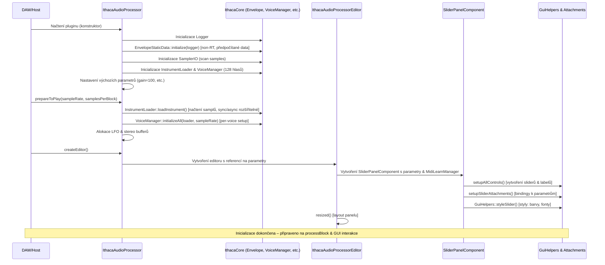
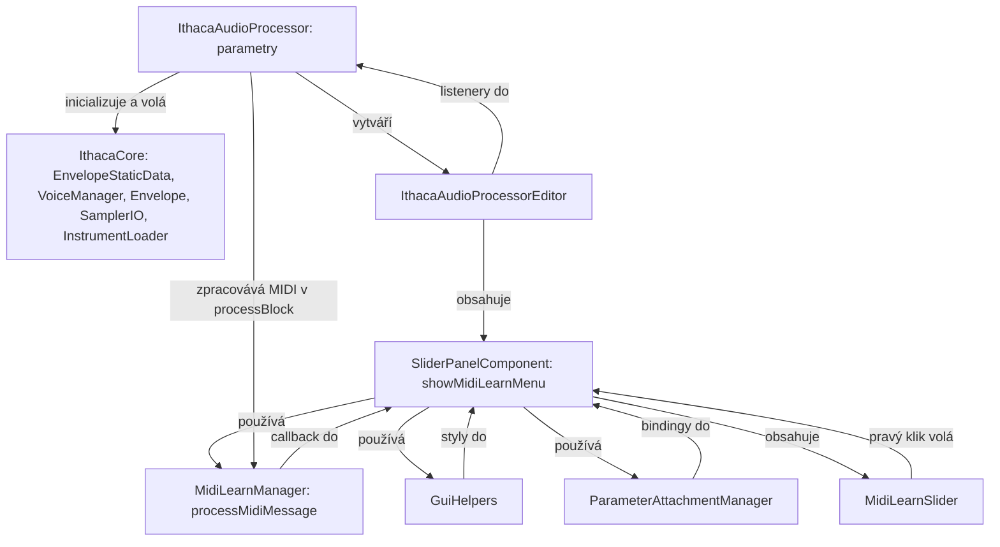

## K implementaci

https://anotherproducer.com/online-tools-for-musicians/midi-cc-list/ 

- All Sound Off           MIDI CC 120:  Mutes all sound. It does so regardless of release time or sustain. (See MIDI CC 123)
- All Notes Off           MIDI CC 123:  Mutes all sounding notes. Release time will still be maintained, and notes held by sustain will not turn off until sustain pedal is depressed.
- Balance (MSB)           MIDI CC 8:    Controls the left and right balance, generally for stereo patches. A value of 64 equals the center.
- Pan (MSB)               MIDI CC 10:   Controls the left and right balance, generally for mono patches. A value of 64 equals the center.
- Volume (MSB)            MIDI CC 7:    Controls the volume of the channel. 
- Modulation Wheel (MSB)  MIDI CC 1:    Generally this CC controls a vibrato effect (pitch, loudness, brighness). What is modulated is based on the patch.

## poznamka ke git

```
git config --global push.autoSetupRemote true
```

```
git checkout -b refactor5
```

```
git push
git remote -v
```

## Požadavky
- Visual Studio Code s rozšířeními CMake Tools a C/C++ od Microsoftu.
- Visual Studio 2022 Build Tools nebo Community Edition (C++ komponenty).
- CMake 3.10+ (v PATH).
- `libsndfile` (automaticky integrováno přes `add_subdirectory` v `CMakeLists.txt`).
- C++17 kompatibilní kompilátor (MSVC/GCC/Clang).

## Postup nastavení
1. Uložte všechny soubory do kořenové složky projektu (např. `IthacaCore`).
2. Vytvořte složku `.vscode` a uložte do ní `tasks.json`, `launch.json` a `settings.json`.
3. Otevřete projekt v VS Code (File → Open Folder).
4. Spusťte CMake: Configure (Ctrl+Shift+P → CMake: Configure) pro generování build souborů ve složce `build`.
5. (Volitelné) Stáhněte `libsndfile` do složky `libsndfile`, pokud není automaticky integrováno.

## Sestavení a spuštění
- **Sestavení**: Spusťte úlohu "build" (Ctrl+Shift+P → Tasks: Run Task → build). Tím se nastaví MSVC prostředí (`vcvars64.bat`) a spustí `cmake --build .`. Výstup: `Debug/IthacaCore.exe`.
- **Spuštění**: Klikněte na tlačítko spustit (|>) nebo stiskněte F5. Program inicializuje logger, načte samples, inicializuje hlasy a testuje polyfonní přehrávání.
- **Výstup**:
  - Konzole: Zprávy o inicializaci a stavu.
  - Log: `core_logger/core_logger.log` obsahuje detaily o načítání, validaci, inicializaci obálek a hlasů.
  - Testovací exporty: WAV soubory ve složce `./exports/tests/`.
- **Čištění**: Smažte složky `build` a `core_logger` pro reset, nebo použijte `cmake --build . --target clean-all`.

**Poznámka**: Upravte cestu k `vcvars64.bat` v `tasks.json`, pokud používáte Visual Studio Community: `C:\Program Files\Microsoft Visual Studio\2022\Community\VC\Auxiliary\Build\vcvars64.bat`. Pro PowerShell povolte skripty: `Set-ExecutionPolicy RemoteSigned -Scope CurrentUser`.

# Helper commands

## Grab-Files
```
PowerShell.exe -ExecutionPolicy Bypass -File .\Grab-Files.ps1
```

## Watch log
```
Get-Content -Path "./core_logger/core_logger.log" -Tail 10 -Wait
```

## Git submodule init
```
git submodule update --init --recursive
```

## Pridani submodulu rucne
```
git submodule add https://github.com/libsndfile/libsndfile libsndfile
```

## Manualne pridat JUCE
```
git clone https://github.com/juce-framework/JUCE.git
```

## Grep z logu

```
# Sleduje log soubor v reálném čase a filtruje řádky obsahující "VoiceManagerTester"
Get-Content -Path "C:\Users\jindr\IthacaCore\build\Debug\Debug\core_logger\core_logger.log" -Tail 10 -Wait | 
Where-Object { $_ -match "VoiceManagerTester" }
```

```
Get-Content -Path "C:\Users\nemej992\Documents\Repos\IthacaCore\build\Debug\Debug\core_logger\core_logger.log" -Tail 10 -Wait | Where-Object { $_ -like "*Test/*" }
```

```
Get-Content -Path "C:\Users\nemej992\Documents\Repos\IthacaCore\build\Debug\Debug\core_logger\core_logger.log" -Tail 10 -Wait | Where-Object { $_ -like "*Envelope/*" }
```

# Build

```
C:\Users\Jindra\Documents\Repos\Ithaca\build\IthacaPlayer_artefacts\Debug\Standalone\IthacaPlayer.exe
```

---
### Inicializace Ithaca Player

Mermaid diagram ukazuje postupnou inicializaci celého Ithaca Player od spuštění pluginu (konstruktor procesoru) přes přípravu audio až po vytvoření GUI. Diagram je sekvenční.



#### Krátké vysvětlení diagramu
- **Sekvence**: Začíná načtením v DAW, pokračuje inicializací core (IthacaCore), přípravou audio a končí GUI setupem.
- **Klíčové body**: Inicializace je non-RT (konstruktor), příprava RT-safe (prepareToPlay). Načítání samplů je sync, ale lze přidat async thread pro optimalizaci.
- **Závislosti**: Procesor je centrem – volá core pro data, editor pro GUI. Změny v panelu (slidery) se vrací zpět do procesoru přes attachmenty.

---
## Popis souborů projektu Ithaca

### Diagram závislostí
Diagram závislostí souborů a metod v projektu (generováno pomocí Mermaid pro lepší vizualizaci). Ukazuje, jak je procesor centrem, který inicializuje IthacaCore, vytváří editor a zpracovává MIDI/GUI změny. Editor a panel závisí na procesoru pro parametry, zatímco GUI komponenty (jako MidiLearnSlider) volají metody pro MIDI a styly.



### Soubor `IthacaAudioProcessor.h/cpp`
**Řešená oblast:** Hlavní audio procesor pluginu, který spravuje celý audio workflow. Inicializuje parametry, integruje IthacaCore komponenty (SamplerIO, InstrumentLoader, EnvelopeStaticData, VoiceManager) pro načítání samplů, obálky a polyfonní zpracování. Zpracovává MIDI vstupy v reálném čase, aplikuje efekty a zajišťuje RT-safe operace. Závislosti: Procesor volá metody z IthacaCore (např. `EnvelopeStaticData::initialize()` v konstruktoru pro globální data, `VoiceManager::processBlock()` v `processBlock` pro mix hlasů). Editor závisí na procesoru pro přístup k parametrům (`AudioProcessorValueTreeState`), kde změny v GUI (přes `sliderValueChanged`) aktualizují parametry v procesoru, což následně volá IthacaCore metody (např. `Envelope::setAttackMIDI()`). Asynchronní načítání samplů: V `prepareToPlay` je načítání synchronní (`InstrumentLoader::loadInstrument()`), ale lze refaktorovat na asynchronní thread (`juce::Thread`) pro velké sample sady, s callbackem pro dokončení (logování prostřednictvím Logger pro sledování průběhu).

| Metoda/Funkce | Parametry | Popis | Návratový typ/Volání |
|---------------|-----------|-------|----------------------|
| `IthacaAudioProcessor()` | - | Konstruktor: Vytvoří `AudioProcessorValueTreeState` pro parametry (masterGain, masterPan, attack, release, sustainLevel, lfoPanSpeed, lfoPanDepth, stereoField). Inicializuje Logger pro logování chyb a událostí. Volá IthacaCore: `EnvelopeStaticData::initialize(logger)` pro předpočítané attack/release křivky (non-RT, alokuje globální buffery pro všechny MIDI hodnoty 0-127 a sample rates 44100/48000). Inicializuje SamplerIO pro scan samples, InstrumentLoader pro načtení do paměti a VoiceManager s 128 hlasy. Nastaví výchozí hodnoty parametrů (např. gain=100, pan=64, attack=0). | `void` – Voláno při načtení pluginu v DAW. // Komentář: Zajistěte volání před audio threadem, aby se vyhnuli RT alokacím; závislost na IthacaCore pro globální data. |
| `~IthacaAudioProcessor()` | - | Destruktor: Uvolní VoiceManager, parametry a logger. Volá IthacaCore: `EnvelopeStaticData::cleanup()` pro uvolnění statických bufferů (attack_buffer_, release_buffer_). | `void` – Automaticky voláno při ukončení pluginu. // Komentář: Prevence memory leaků v globálních datech; závislost na IthacaCore pro čištění. |
| `prepareToPlay(double sampleRate, int samplesPerBlock)` | `sampleRate` (např. 44100), `samplesPerBlock` (např. 512) | Připraví procesor na zpracování: Nastaví sample rate pro VoiceManager a Envelope. Volá IthacaCore: `InstrumentLoader::loadInstrument()` pro načtení samples do stereo float bufferů [L,R,L,R...], pak `VoiceManager::initializeAll(loader, sampleRate)` pro inicializaci per-voice stavů (např. `Voice::initialize(instrument, sampleRate)` s delegací na Envelope). Alokuje buffery pro LFO a stereo field. Asynchronní rozšíření: Lze obalit do `juce::Thread` pro background načítání, s waitem na dokončení před návratem. | `void` – Voláno JUCE před prvním `processBlock`. // Komentář: RT-safe příprava, bez alokací v loopu; závislost na IthacaCore pro inicializaci hlasů. |
| `releaseResources()` | - | Uvolní zdroje: Vyčistí buffery a hlasy, pokud není aktivní audio. Volá IthacaCore: `VoiceManager::cleanup()` pro reset hlasů (např. uvolnění per-voice pointerů na samples). | `void` – Voláno JUCE při pauze audio. // Komentář: Použijte pro dlouhodobé uvolnění paměti; závislost na IthacaCore pro čištění. |
| `processBlock(juce::AudioBuffer<float>& buffer, juce::MidiBuffer& midiMessages)` | `buffer` (výstupní audio buffer), `midiMessages` (MIDI zprávy) | Zpracuje audio blok: Prochází MIDI zprávy – note-on/off volá IthacaCore: `VoiceManager::setNoteState(midiNote, isOn, velocity)` (přepíná stavy Idle/Attacking/Sustaining/Releasing, aplikuje velocity na gain); CC aktualizuje parametry (např. CC73 volá `Envelope::setAttackMIDI(ccValue)` pro RT-safe nastavení MIDI indexu). Aplikuje master gain/pan, LFO modulaci (pan depth/speed na základě sin wave) a volá IthacaCore: `VoiceManager::processBlock(buffer, numSamples)` pro mixování aktivních hlasů (např. `Voice::processBlock(outputBuffer, numSamples)` s aplikací `Envelope::getAttackGains()` nebo `getReleaseGains()` pro RT-safe gain buffery). | `void` – Voláno JUCE v audio threadu pro každý blok (např. 512 samples). // Komentář: RT-safe: Žádné alokace, pouze memcpy gainů z předpočítaných dat; závislost na IthacaCore pro voice mixing, editor ovlivňuje skrz CC update. |
| `getName()` | - | Vrátí název pluginu ("Ithaca Sampler"). | `juce::String` – Použito JUCE pro UI. // Komentář: Statický string pro identifikaci; bez závislostí. |
| `createEditor()` | - | Vytvoří a vrátí instanci `IthacaAudioProcessorEditor` pro GUI, předává referenci na parametry a MidiLearnManager. | `std::unique_ptr<juce::AudioProcessorEditor>` – Voláno JUCE pro zobrazení editoru. // Komentář: Oddělení GUI od procesoru pro thread safety; editor závisí na procesoru pro parametry. |
| `hasEditor() const` | - | Potvrzuje podporu GUI editoru. | `bool` (true) – Voláno JUCE pro kontrolu. // Komentář: Povinné pro JUCE pluginy s GUI; bez závislostí. |
| `getNumPrograms()` / `setCurrentProgram(int index)` / `getProgramName(int index)` | `index` (pro set/get) | Správa programů: Jednoduchá implementace pro preset (výchozí "Default"). Volá IthacaCore: `VoiceManager::reset()` při změně preset pro reset hlasů. | `int` / `void` / `juce::String` – Pro JUCE preset systém. // Komentář: Rozšiřitelné pro více presetů s uložením envelope nastavení; závislost na IthacaCore pro reset. |

**Workflow příklad:** Konstruktor inicializuje IthacaCore (EnvelopeStaticData, SamplerIO) → `prepareToPlay` načte samples přes InstrumentLoader (sync, rozšiřitelné na async) → `processBlock` parsuje MIDI, volá VoiceManager pro mix s envelope gains → Editor zobrazuje parametry, jeho změny ovlivňují procesor.

### Soubor `IthacaAudioProcessorEditor.h/cpp`
**Řešená oblast:** GUI editor pluginu, který zobrazuje a ovládá parametry. Spravuje layout komponent (jako SliderPanel), předává parametry do GUI a aktualizuje na změny. Závislosti: Editor závisí na procesoru pro přístup k `AudioProcessorValueTreeState` (parametry), kde `sliderValueChanged` aktualizuje hodnoty v procesoru, což spustí IthacaCore metody (např. `Envelope::setSustainLevelMIDI()`). Procesor volá `createEditor()` pro vytvoření instance; GUI styly (barvy, fonty) jsou řízeny `GuiHelpers`, s rounded overlay pro moderní vzhled. Asynchronní načítání samplů: Nezávislé na editoru, ale editor může zobrazit progress bar při async load v procesoru.

| Metoda/Funkce | Parametry | Popis | Návratový typ/Volání |
|---------------|-----------|-------|----------------------|
| `IthacaAudioProcessorEditor(IthacaAudioProcessor&)` | `audioProcessor` (referenční procesor) | Konstruktor: Inicializuje editor s referencí na procesor, vytvoří `SliderPanelComponent` s parametry a MidiLearnManager, přidá komponenty do layoutu (`addAndMakeVisible`) a nastaví resize listener. Volá `setDebugMode(false)` pro standardní vzhled (bílé labely, modrý thumb). | `void` – Voláno z `createEditor()` procesoru. // Komentář: Předává `audioProcessor.parameters` pro attachmenty; závislost na procesoru pro data. |
| `~IthacaAudioProcessorEditor()` | - | Destruktor: Odstraní všechny dítě komponenty a uvolní attachmenty. | `void` – Automaticky voláno při zavření editoru. // Komentář: Prevence leaků v GUI komponentách; bez závislostí na core. |
| `paint(juce::Graphics& g)` | `g` (graphics kontext) | Kreslí pozadí editoru: Používá `GuiHelpers::drawRoundedOverlay` pro poloprůhledný overlay s zaoblenými rohy (alpha=0.5, radius=8px, šedý gradient). | `void` – Voláno JUCE při redraw (např. resize). // Komentář: Nezávislé na IthacaCore, čistě GUI; styluje celý editor pro konzistentní vzhled. |
| `resized()` | - | Aktualizuje layout: Volá `sliderPanel->resized()` pro přizpůsobení panelu velikosti okna. | `void` – Voláno JUCE při změně velikosti okna. // Komentář: Responzivní layout, bez volání IthacaCore; závislost na SliderPanel pro sublayout. |
| `sliderValueChanged(juce::Slider* slider)` | `slider` (změněný slider) | Listener pro slidery: Aktualizuje odpovídající parametr v `AudioProcessorValueTreeState` (např. pro attack: `parameters.getRawParameterValue("attack")->load() = slider->getValue()`), což nepřímo volá IthacaCore metody v procesoru (např. `Envelope::setAttackMIDI(value)`). Notifikuje procesor o změně. | `void` – Voláno z `SliderPanelComponent` při pohybu sliderem. // Komentář: Sync GUI s core parametry, RT-safe skrz atomic hodnoty; závislost na procesoru pro update. |

**Workflow příklad:** Konstruktor přidá panel → `resized` layoutuje → Změna slideru volá listener pro sync s procesorem, který aktualizuje IthacaCore envelope; styly z GuiHelpers zajišťují vizuální konzistenci.

### Soubor `SliderPanelComponent.h/cpp`
**Řešená oblast:** Centrální GUI panel se všemi slidery pro parametry (gain, pan, ADSR, LFO, stereo field). Podporuje MIDI Learn přes pravý klik, debug mód a attachmenty k parametrům. Layout je responzivní s separátory. Závislosti: Panel volá metody z MidiLearnManager pro learning (`onLearningStateChanged`), attachmenty z ParameterAttachmentManager pro sync s procesorem (změny volají `sliderValueChanged` v editoru, což ovlivní IthacaCore skrz procesor). Grafické styly: Používá `GuiHelpers` pro barvy (modrý thumb #007BFF, šedý track #CCCCCC), fonty (12pt pro labely) a separátory (šedé čáry); v debug módu černé pozadí pro lepší viditelnost. Asynchronní načítání samplů: Nezávislé, ale panel může zobrazit loading indikátor při async operacích v procesoru.

| Metoda/Funkce | Parametry | Popis | Návratový typ/Volání |
|---------------|-----------|-------|----------------------|
| `SliderPanelComponent(AudioProcessorValueTreeState&, MidiLearnManager*)` | `parameters` (parametry), `midiLearnManager` (pro MIDI learn) | Konstruktor: Inicializuje debug mód, volá `setupAllControls()` pro vytvoření sliderů a labelů, pak `setupSliderAttachments()` pro binding k parametrům. Slidery jsou `MidiLearnSlider` pro pravý klik. Styly: Volá `GuiHelpers::styleSlider` pro modrý thumb a šedý track. | `void` – Voláno v editoru. // Komentář: Bindingy umožňují aktualizaci IthacaCore parametrů (např. attack → `Envelope::setAttackMIDI()`); závislost na editoru pro listenery. |
| `~SliderPanelComponent()` | - | Destruktor: Odstraní všechny komponenty a attachmenty. | `void` – Automaticky. // Komentář: Čištění GUI, bez vlivu na core. |
| `paint(juce::Graphics& g)` | `g` | Kreslí overlay a separátory: Používá `GuiHelpers::drawRoundedOverlay` (alpha=0.5, radius=8px) a `paintSeparators` pro šedé čáry mezi řádky. | `void` – Voláno JUCE při redraw. // Komentář: Čistě vizuální, nezávislé na IthacaCore; styluje panel pro moderní UI. |
| `resized()` | - | Aktualizuje layout: Vymaže separátory, volá `layoutBackgroundMode` nebo `layoutDebugMode` podle módu. Řadí slidery do řádků (např. masterGain/stereoField). | `void` – Voláno z editoru při resize. // Komentář: Responzivní pro různé velikosti oken; závislost na GuiHelpers pro positioning. |
| `setDebugMode(bool enabled)` | `enabled` (true pro debug) | Přepne debug mód: Rekonfiguruje styly sliderů (černé pozadí, bílý text) a layout (debug: vertikální stack, background: horizontální řádky). Volá `setupAllControls()` a `resized()`. | `void` – Voláno z editoru pro testování. // Komentář: Debug mód ignoruje overlay pro snadné ladění; styly z GuiHelpers. |
| `onLearningStateChanged(bool isLearning, String parameterID)` | `isLearning` (stav), `parameterID` (např. "attack") | Callback z MidiLearnManager: Aktualizuje vizuály specifického slideru (`updateSliderLearningVisuals`) – červený thumb při learningu (přes `GuiHelpers::styleSlider`). | `void` – Voláno při změně learning stavu. // Komentář: Vizuální feedback pro MIDI assignment; závislost na MidiLearnManager. |
| `setupAllControls()` | - | Vytvoří komponenty: Volá `createMasterControls()`, `createLFOControls()`, `createADSRControls()`, `createPanControl()` pro slidery (`MidiLearnSlider`) a labely (styly: 12pt font, bílá barva). Každý slider má callback pro MIDI menu. | `void` – Voláno v konstruktoru a při debug switch. // Komentář: Slidery jako attack mají RT-safe vliv na `Envelope::setAttackMIDI()`; závislost na GuiHelpers pro styly. |
| `setupSliderAttachments()` | - | Vytvoří bindingy: Používá `ParameterAttachmentManager::createAllAttachments` pro sync sliderů s parametry (např. gain ↔ "masterGain"). Změny volají IthacaCore metody skrz procesor. | `void` – Voláno po vytvoření sliderů. // Komentář: Bidirekcionální sync pro real-time změny; závislost na editoru pro listenery. |
| `showMidiLearnMenu(Slider*, Point<int>)` | `slider` (cílový slider), `pos` (pozice) | Zobrazí popup menu: Přidá položky "Learn MIDI CC" nebo "Clear" na základě aktuálního mappingu (`midiLearnManager_->getCCNumberForParameter`). Volá `startLearning` při výběru. | `void` – Voláno z `MidiLearnSlider::mouseDown` při pravém kliku. // Komentář: Integrace s MidiLearnManager pro CC assignment; ovlivní IthacaCore skrz procesor. |
| `sliderValueChanged(Slider*)` | `slider` | Listener: Prázdný, protože attachmenty řídí změny. | `void` – Voláno JUCE při změně slideru. // Komentář: Delegace na attachmenty pro automatický update; závislost na procesoru. |

**Workflow příklad:** Konstruktor vytvoří slidery → `resized` layoutuje do řádků (Master/LFO/ADSR/Pan) → Změna slideru (např. release=40) volá attachment, což skrz procesor nastaví `Envelope::setReleaseMIDI(40)` → Pravý klik volá menu pro MIDI learn; styly zajišťují konzistenci (modrý thumb, šedý track).

### Soubor `MidiLearnManager.h/cpp`
**Řešená oblast:** Správa MIDI CC mappingu pro parametry. Ukládá přiřazení CC → parametr, zpracovává MIDI zprávy a notifikuje GUI o změnách. Závislosti: Voláno z procesoru v `processBlock` pro zpracování MIDI (`processMidiMessage`), což ovlivní parametry a IthacaCore (např. `Envelope::setAttackMIDI()`). GUI (SliderPanel) závisí na callbacku `onLearningStateChanged` pro vizuály; procesor aplikuje mappingy v `applyMappingsToParameters`. Grafické styly: Nezávislé, ale ovlivňuje GUI vizuály (červený thumb při learningu skrz `GuiHelpers`).

| Metoda/Funkce | Parametry | Popis | Návratový typ/Volání |
|---------------|-----------|-------|----------------------|
| `MidiLearnManager()` | - | Konstruktor: Inicializuje mapu `std::unordered_map<String, int>` pro CC → parametr a stav learningu. | `void` – Voláno v editoru. // Komentář: Globální mapa pro všechny parametry; závislost na procesoru pro MIDI. |
| `startLearning(String parameterID, String displayName)` | `parameterID` (např. "attack"), `displayName` (pro alert) | Spustí learning: Nastaví `learningParameterID = parameterID`, zobrazí alert "Move MIDI control...". Notifikuje GUI přes `onLearningStateChanged(true, parameterID)`. | `void` – Voláno z `showMidiLearnMenu`. // Komentář: Připraví na zachycení CC v `processMidiMessage`; závislost na GUI pro feedback. |
| `processMidiMessage(juce::MidiMessage& message)` | `message` (MIDI zpráva) | Zpracuje CC: Pokud je v learning módu a je to CC (0xB0), přiřadí CC číslo k `learningParameterID` v mapě, ukončí learning (`onLearningStateChanged(false, "")`) a vrátí true. | `bool` (true pokud zpracováno) – Voláno v `processBlock` procesoru pro každou MIDI zprávu. // Komentář: Po přiřazení aplikuje CC na parametr, což volá IthacaCore metody (např. `setAttackMIDI()`); závislost na procesoru. |
| `getCCNumberForParameter(String parameterID)` | `parameterID` | Vrátí přiřazené CC číslo (-1 pokud žádné). Použito pro menu text. | `int` – Voláno v `showMidiLearnMenu`. // Komentář: Kontrola existujícího mappingu; závislost na GUI menu. |
| `removeMappingForParameter(String parameterID)` | `parameterID` | Odstraní mapping z mapy a notifikuje GUI. | `void` – Voláno z menu "Clear MIDI CC". // Komentář: Reset parametrů na výchozí, bez vlivu na IthacaCore data; závislost na GUI. |
| `applyMappingsToParameters(MidiBuffer& midiBuffer)` | `midiBuffer` | Aplikuje mappingy: Pro každou CC v bufferu aktualizuje odpovídající parametr (např. CC7 → masterGain.setValue(ccValue)), což skrz procesor volá IthacaCore (např. `Envelope::setSustainLevelMIDI()` pro CC74). | `void` – Voláno v `processBlock` po parsování MIDI. // Komentář: RT-safe aktualizace, použití atomic pro parametry; závislost na procesoru pro update. |

**Workflow příklad:** `startLearning("attack")` → `processMidiMessage(CC73=64)` přiřadí → `applyMappingsToParameters` aktualizuje parametr v reálném čase, což volá `Envelope::setAttackMIDI(64)`; závislost na GUI pro vizuály.

### Soubor `MidiLearnSlider.h/cpp`
**Řešená oblast:** Vlastní rozšíření `juce::Slider` s podporou pravého kliku pro MIDI Learn. Umožňuje callback při kliku pro spuštění menu. Závislosti: Voláno z SliderPanel (`setRightClickCallback`), což spustí menu a ovlivní MidiLearnManager; nepřímo aktualizuje procesor a IthacaCore skrz learning. Grafické styly: Thumb barva měněna skrz `GuiHelpers` (např. červený při learningu).

| Metoda/Funkce | Parametry | Popis | Návratový typ/Volání |
|---------------|-----------|-------|----------------------|
| `MidiLearnSlider(Slider::SliderStyle style, TextEntryBoxPosition textBox)` | `style` (LinearHorizontal), `textBox` (NoTextBox) | Konstruktor: Standardní slider s prázdným callbackem pro pravý klik. | `void` – Voláno v `SliderPanelComponent::create*Controls`. // Komentář: Rozšíření pro GUI interakci; závislost na panelu. |
| `mouseDown(const MouseEvent& event)` | `event` (mouse událost) | Zpracuje klik: Pokud je to pravý tlačítko (`event.mods.isRightButtonDown()`), volá `rightClickCallback_(event.getPosition())`. Jinak standardní chování slideru. | `void` – Voláno JUCE při kliku na slider. // Komentář: Detekce pro MIDI menu; závislost na MidiLearnManager. |
| `setRightClickCallback(std::function<void(Point<int>)> callback)` | `callback` (lambda pro menu) | Nastaví callback: Např. `[this](Point pos) { showMidiLearnMenu(this, pos); }`. | `void` – Voláno po vytvoření slideru v panelu. // Komentář: Spojení s MidiLearnManager; ovlivní core skrz CC. |

**Workflow příklad:** Vytvoření slideru → `setRightClickCallback` → `mouseDown` detekuje pravý klik → Volá menu, což může vést k IthacaCore aktualizaci přes CC; styly mění barvu thumbu.

### Soubor `GuiHelpers.h/cpp`
**Řešená oblast:** Pomocné utility pro GUI: Styly, layout a kreslení prvků (overlay, separátory, labely). Zajišťuje konzistentní vzhled v debug i produkčním módu. Závislosti: Voláno z SliderPanel a editoru pro styly (např. `styleSlider` pro thumb/track barvy); ovlivňuje vizuály learningu v MidiLearnManager. Grafické styly: Definuje barvy (modrý thumb #007BFF, šedý track #CCCCCC, bílé labely #FFFFFF), fonty (Arial 12pt), gradienty pro overlay (tmavý šedý #333333). Asynchronní načítání: Nezávislé, ale může zobrazit progress při async load.

| Funkce | Parametry | Popis | Návratový typ/Volání |
|--------|-----------|-------|----------------------|
| `drawRoundedOverlay(juce::Graphics& g, juce::Rectangle<int> bounds, float alpha, float radius)` | `g` (graphics), `bounds` (oblast), `alpha` (průhlednost 0.5), `radius` (8px) | Kreslí zaoblený obdélník s gradientem (tmavý šedý #333333) a průhledností. | `void` – Voláno v `paint` editoru/panelu. // Komentář: Vizuální overlay pro panel; závislost na editoru. |
| `positionHorizontalSliderWithLabel(juce::Rectangle<int> bounds, juce::Label* label, juce::Slider* slider)` | `bounds` (řádek), `label` (text), `slider` (ovládání) | Layout: Umístí label nahoře (20% výšky) a slider dole, s paddingem 4px. | `void` – Voláno v `layoutSliderRow` nebo debug layoutu. // Komentář: Standardní positioning pro responzivitu; závislost na panelu. |
| `styleSlider(juce::Slider& slider, bool debugMode)` | `slider` (cílový), `debugMode` (true pro černé barvy) | Nastaví barvy: Thumb (modrý #007BFF), track (šedý #CCCCCC), v debugu černé pozadí (#000000) a bílý text (#FFFFFF). | `void` – Voláno po vytvoření každého slideru. // Komentář: Rozšířeno pro learning: Červený thumb (#FF0000) při aktivním stavu; závislost na MidiLearnManager. |
| `createSliderLabel(const juce::String& text, bool debugMode)` | `text` (např. "Attack"), `debugMode` | Vytvoří label: Nastaví font (Arial 12pt), barvu (bílá #FFFFFF/černá #000000 podle módu) a zarovnání (střed). | `std::unique_ptr<juce::Label>` – Voláno v `create*Controls`. // Komentář: Konzistentní labely pro parametry; závislost na panelu. |
| `drawSeparatorLine(juce::Graphics& g, int x1, int y1, int x2, int y2)` | `g`, `x1/y1` (začátek), `x2/y2` (konec) | Kreslí tenkou šedou čáru (#999999) jako separátor mezi řádky. | `void` – Voláno v `paintSeparators`. // Komentář: Vizuální oddělení sekcí; závislost na panelu. |
| `isDebugModeEnabled()` | - | Kontroluje globální debug flag z konstant (např. z #define). | `bool` – Voláno v konstruktoru panelu. // Komentář: Přepínač pro testování bez overlay. |

**Workflow příklad:** `createSliderLabel("Gain", false)` → `styleSlider(slider, false)` → `positionHorizontalSliderWithLabel(row, label, slider)` – Čistě GUI, ale podporuje vizuály pro IthacaCore parametry; závislost na editoru pro redraw.

### Soubor `ParameterAttachmentManager.h/cpp`
**Řešená oblast:** Správa bidirekcionálních vazeb mezi JUCE parametry a GUI slidery. Automaticky vytváří listenery pro sync hodnot (slider ↔ parametr). Závislosti: Voláno z SliderPanel (`setupSliderAttachments`), což ovlivní editor (`sliderValueChanged`) a procesor (aktualizace parametrů volá IthacaCore metody jako `Envelope::setReleaseMIDI()`). Grafické styly: Nezávislé, ale sync zajišťuje konzistentní vizuály při změnách.

| Metoda/Funkce | Parametry | Popis | Návratový typ/Volání |
|---------------|-----------|-------|----------------------|
| `createAllAttachments(AudioProcessorValueTreeState& parameters, SliderSet& sliders)` | `parameters` (ValueTreeState), `sliders` (struktura s pointery na slidery: masterGain, attack atd.) | Vytvoří attachmenty: Pro každý slider (např. `std::make_unique<AudioParameterAttachment>(parameters.getParameter("masterGain"), *sliders.masterGain)`) a přidá listenery pro změny. Kontroluje, zda všechny parametry existují. Změny delegují na IthacaCore (např. release → `Envelope::setReleaseMIDI()`). | `bool` (true při úspěchu, false při chybě) – Voláno v `setupSliderAttachments`. // Komentář: RT-safe atomic bindingy pro real-time update; závislost na editoru a procesoru pro sync. |

**Workflow příklad:** Struktura `SliderSet sliders { .masterGain = masterGainSlider.get(), ... };` → `createAllAttachments(parameters, sliders)` → Automatický sync při změně slideru/parametru, ovlivňující IthacaCore envelope; závislost na GUI pro inicializaci.